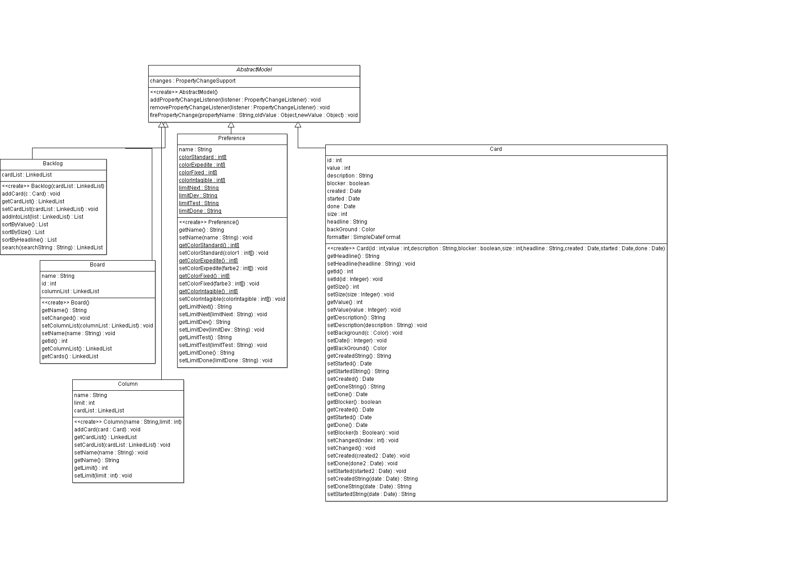

# Architekturdokumentation

# 1. Einführung und Ziele

## 1.1. Aufgabenstellung
 Im Rahmen der Veranstaltung "Entwicklung eines Informationssystems im Team" soll ein Kanban-Brett erstellt werden, das ein 
Vorgehensmodell in der Softwareentwicklung darstellt. Ziel eines solchen Modells ist es, die Anzahl paralleler Arbeiten zu reduzieren und 
somit schnellere Durchlaufzeiten zu erreichen. Dadurch sollen Probleme schnell scihtbar gemacht werden.  
## 1.2. Qualitätsziele
## 1.3. Stakeholder

# 2. Randbedingungen

## 2.1. Technische Randbedingungen
Jede/r Teilnehmer/in an diesem Projekt ist in Besitz eines Notebooks, auf dem er/sie seinen/ihren Beitrag zur Realisierung beisteuern kann. Zur Entwicklung 
nutzen alle Teilnehmer/innen die Entwicklungsumgebung Eclipse. Als Plug-Ins sind bei allen Mitwirkenden neben den Standard-Java-Libraries ein Eclipse Git 
Teamprovider, sowie die Eclipse GitHub-Integration und Maven Integration for Eclipse "m2e" intsalliert. Für den Austausch des Quellcodes wurde eine Repository 
(https://github.com/seilerf/fh-kanban) bei github.com erstellt. Dies ist ein Fork einer anderen Repository (https://github.com/nikolaialex/fh-kanban). Diese Repository 
wurde von Nikolai Alex erstellt und stellt der Basis für die Enwticklung der Kanban-Applikation dar. Jeder Teilnehmer/in hat Zugriff auf diese Repository und wurde 
als "Member" eingetragen, sodass jede/r seinen/ihren eigenen Code integrieren kann. Dies wurde mit einem Test innerhalb der Vorlesungszeit bestätigt. 

## 2.2. Organisatorische Randbedingungen
Der Zeitrahmen für das Projekt beträgt 14 Tage. Beginn des Projektes war am 01.07.2013, die Abgabe ist auf den 14.07.2013 terminiert. 

Die Mitwirkenden des Projektes haben unterschiedliche Wohnorte, weshalb darauf verzichtet wurde, eine gemeinsame Entwicklung in den Hochschulräumen der Ostfalia in Wolfsburg
durchzuführen. Es wurden Aufgaben verteilt und dann bei einem gelegentlichen Treffen in Wolfsburg, via Skype unter einzelnen Teilnehmern/innen oder via Facebook unter allen 
Teilnehmern/innen besprochen. 
## 2.3. Konventionen

# 3. Kontextabgrenzung

## 3.1. Fachlicher Kontext
## 3.2. Technischer Kontext
## 3.3. Externe Schnittstellen

# 4. Lösungsstrategie

# 5. Bausteinsicht

# 6. Laufzeitsicht

# 7. Konzepte
## 7.1 Fachliche Strukturen

### 7.1.1 Card
Die Klasse Card repräsentiert die Kanban-Karten auf Domainebene. Sie mit ist mit dem CardController und der CardView über das MVC-Pattern
verknüpft. Um ihre Werte abzurufen und zu setzen verfügt sie über die passenden Getter und Setter Funktionen. Die zur Verfügung gestellten
Attribute:
ID: 			==> Integer
Aufwand: 		==> Integer	
Beschreibung:	==> String
Blocker:		==> Boolean
Wert: 			==> Integer
Created:		==> Date
Started:		==> Date
Done:			==> Date
Headline:		==> String
Background: 	==> Color

### 7.1.2 CardController
Der CardController ist eine abgeleitete Klasse vom abstrakten Controller und dient zur Kommunikation zwischen der Karte und der KarteView.
Hier werden die benötigten String Properties für die Kommunikation anleget. Des Weiteren erfolgen hier die Funktionsaufrufe, welche für
für die Anpassung der Werte in der Karte von Nöten ist.

### 7.1.3 AbstractController
Der AbstractKontroller implmentiert das Interface PropertyChangeListener und importiert zusätzlich die den PropertyChangeListener. Er
verfügt jeweils über eine ArrayList, in welcher die Views und die Models gespeichert werden. Zusätzlich werden noch Methoden zum Hinzufügen
und zum Löschen von Views und Models bereitgestellt. Des Weiteren stellt der AbstractController die Methode setModelProperty() zur Verfügung,
welche mit den Übergabeparametern PropertyName und newValue die Arrayliste der Modelle durchläuft und die entsprechenden Setter-Methoden der 
Card Klasse entsprechend der PropertyNamen aufruft und dieses entsprechend setzt.

## 7.2 Typische Muster und Strukturen
### 7.2.1 Muster
#### 7.2.1.1 MVC
### 7.2.2 Datenstrukturen
#### 7.2.2.1 Listen
#### 7.2.2.2 
## 7.3. Ausnahme- und Fehlerbehandlung
## 7.4. Bedienoberfläche
### 7.4.1 CardView
Die CardView ist eine interaktive Benutzeroberfläche und dient einerseits zur Darstellung der Karten auf dem Kanban-Board, welche 
durch die BoardView repräsentiert werden, und andererseits zum Anlegen neuer Karten. Beim Anlegen einer neuen Karte müssen die 
notwendigen Attribute, entsprechend der Klasse Card, in die passenden Gui-Felder eingetragen werden. Die CardView verfügt über
mehrere verschiedene Buttons, die nicht zu jedem Zeitpunkt verfügbar und sichtbar sind. Zum Bespiel beim Anlegen einer neuen Karte
muss zuerst ein Titel gesetzt werden über den Title Button um, die Möglichkeit zu haben die Karte speichern zu können. Des Weiteren
ist erst nach dem ersten Speichern die Möglichkeit des Resets freigegeben. Denn der Reset Button setzt falls ausgewählt auf den ersten
gespeicherten Zustand zurück, egal wieviele verschiedene Speicherungen in der Folge durchgeführt wurden. Als vierter und letzter Button
existiert der Delete Button, welcher die einfache Funktion hat alle in der Gui dargestellten Werte auf den Ausgangszustand zurück
zusetzen.
Ebenfalls wird die CardView genutzt um die Kanban-Karten in der BoardView darzustellen. Die dort genutzten CardViews verfügen ebenfalls
über die zuvor dargestellten Funktionen, allerdings ist die Möglichkeit des Titel setzen nicht gegeben, weil die in der BoardView
dargestellten Karten aus der XML-Datei eingelesen werden und bereits über einen Titel verfügen und dieser damit nicht mehr neu
erzeugt werden muss. Im nachhinein ist eine Änderung des Titels nicht mehr möglich.
Die Eingaben sind treu den Datentypen entsprechend durchzuführen um Fehlermeldungen zu vermeiden.
ID: 		==> Integer	(Wird automatisch gesetzt)
Aufwand: 	==> Integer	(Darf nicht null sein oder ein falscher Datentyp)
Beschreibung:	==> String	(Darf nicht null sein)
Wert:		==> ComboBox	(Es muss eine Auswahl getroffen werden/Darf nicht null sein)
Blocker:	==> Boolean	(Grundzustand : false kann auf true geändert werden)
Created:	==> ToggleButton(Gehört zur Buttongroup eine der drei Auswahlmöglichkeiten muss gesetzt werden)
Started:	==> ToggleButton(Gehört zur Buttongroup eine der drei Auswahlmöglichkeiten muss gesetzt werden)
Done:		==> ToggleButton(Gehört zur Buttongroup eine der drei Auswahlmöglichkeiten muss gesetzt werden)
Die CardView interagiert mit dem CardController um die in der Gui gesetzen Werte in die Modelklasse Card zu übertragen.
Da die Klassen Card, CardController und CardView mit dem MVC-Pattern realisiert wurden.

## 7.5. Ergonomie
## 7.6. Geschäftsregeln
## 7.7. Konfiguration
Das Kanban System bietet eine Möglichkeit verschiedene Sachen auf dem Board zur Laufzeit einszustellen. 
Hierfür gibt es ein Menüpunkt Einstellungen. Beim öffnen dieses Menüpunktes erscheint ein Fenster, welches diverse Einstellungsmöglichkeiten bietet.
Es ist möglich den Namen des Boards zu ändern. Durch betätigen des Namen Speicherns Button wird dies wirksam.
Dazu kann man noch die 4 verschiedenen Zeitbeschränkungs-Farben einstellen. Dies wird ohne Bestätigung sofort umgesetzt. Zusätzlich ist es möglich,
Das Karten-Limit pro Spalte einzustellen. Das heißt wie viele Karten pro Spalte sich maximal dort befinden dürfen.

## 7.8. Logging, Protokollierung
## 7.9. Management und Administrierbarkeit
## 7.10. Persistenz
Ein Kanban-Brett kann mit diesem Programm persistent gespeichert werden. Dazu öffnet man in der Menüleisete das Feld "Datei" und wählt 
dann "Board speichern...". Es öffnet sich ein Dialog, in dem man den Speicherort angeben kann. 

Die Speicherung kann in Form einer XML-Datei erfolgen. Ein DataManager erkennt, in welchem Format die Datei gespeichert werden soll und 
ruft den dazu notwendigen Parser auf. Bei der Speicherung im XML-Format wird dann ein XMLParser aufgerufen, der als Parameter das gesamte 
Board übergeben bekommt und dann alle Spalten und deren Karten durchläuft und in XML-Schreibweise parst. Als Zieldatei kann eine beliebige Datei im XML-Format
angegeben oder auch neu erstellt werden, sofern der User die Berechtigung hat, auf das Verzeichnis, in dem gespeichert werden soll, zuzugreifen. 

Der Ablauf für die Speicherung eines Boards in HTML-Schreibweise ist ähnlich. Es muss wieder der Dateimenüeintrag "Board speichern..." ausgewählt werden. Gibt der 
Benutzer nun allerdings eine Datei mit der Endung ".html" ein, so erkennt das der DataManager und ruft dementsprechend eine andere Funktion auf - die HTMLExport-Funktion. 
Diese legt dann alle Karten des Boards in einem HTML-Dokument an. Dieses Dokument kann der Dokumention von Ständen des Bretts zu einem bestimmten Entwicklungszeitpunkt dienen. 
## 7.11. Plausibilisierung und Validierung
## 7.12. Transaktionsbehandlung
